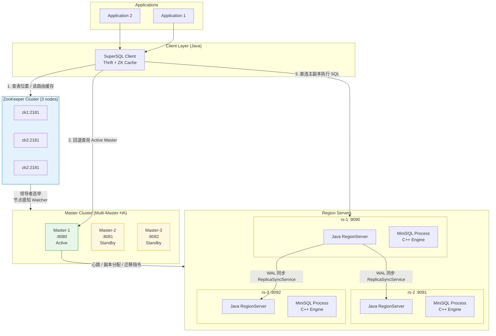
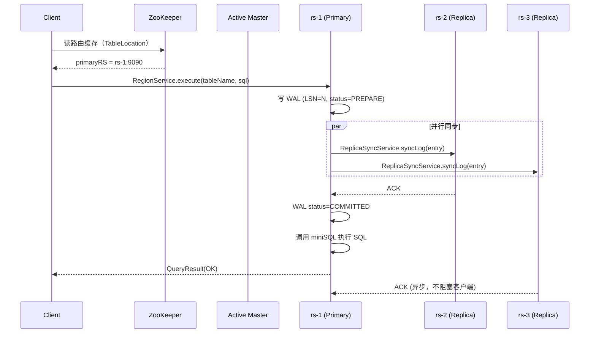
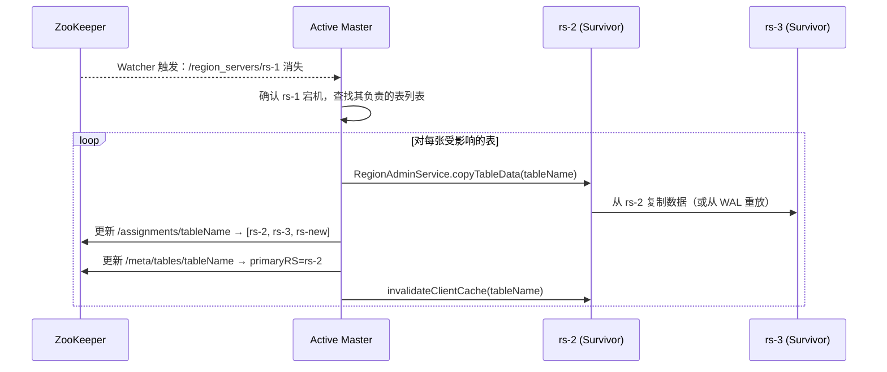

# SuperSQL — 分布式关系型数据库

> A distributed relational database system built on top of MiniSQL, featuring table-level data distribution, 3-replica majority-ack writes, multi-Master high availability, ZooKeeper-based cluster coordination, and Apache Thrift RPC communication.
>
> 基于 MiniSQL 演进的分布式关系型数据库，实现表级数据分布、3 副本多数派提交（半同步）、多 Master 高可用、ZooKeeper 集群协调与 Apache Thrift 跨语言 RPC 通信。

**浙江大学《大规模信息系统构建技术导论》课程大作业**

---

## 目录

- [项目简介](#项目简介)
- [系统架构](#系统架构)
- [核心功能](#核心功能)
- [当前实现状态](#当前实现状态)
- [技术栈与设计决策](#技术栈与设计决策)
- [快速启动](#快速启动)
- [项目结构](#项目结构)
- [ZooKeeper 目录结构](#zookeeper-目录结构)
- [RPC 接口总览](#rpc-接口总览)
- [开发分工](#开发分工)
- [迭代路线图](#迭代路线图)

---

## 项目简介

### 中文

SuperSQL 在单机版 MiniSQL（C++ 实现，含 B+ 树索引、缓冲池、堆文件存储）的基础上，构建完整的分布式层。仿照 HBase 思想，以**整张表（Table）**为 Region 粒度，支持多 Region Server 横向扩展。分布式层全部使用 **Java 17 + Maven** 编写，Region Server 通过 `ProcessBuilder` 管理本地 MiniSQL 进程，实现 C++ 存储引擎与 Java 分布式框架的无缝整合。

### English

SuperSQL extends the single-node MiniSQL engine (C++, B+ tree + buffer pool + heap files) with a full distributed layer written in Java 17. Inspired by HBase, it distributes data at the **table** granularity across Region Servers. The Java layer manages MiniSQL processes via `ProcessBuilder`, seamlessly bridging the C++ storage engine and the Java distributed framework.

---

## 系统架构



### 数据流：写操作（INSERT / DELETE）



### 容灾流程：Region Server 宕机



---

## 核心功能（目标能力）

> 说明：本节描述系统设计目标与能力边界，不等同于“全部已在代码中落地”。
> 实际落地进展请以 `IMPLEMENTATION_STATUS.md` 为准。

| 功能模块 | 描述 |
|---|---|
| **表级数据分布** | 以整张表为 Region 单位分配到 Region Server，无需行级切分 |
| **3 副本多数派提交（半同步）** | 主副本写 WAL PREPARE → 并行同步 ≥1 从副本 → COMMIT → 返回客户端 |
| **WAL 日志机制** | Append-only 二进制日志，支持 Crash Recovery 和副本追赶 |
| **多 Master 高可用** | ZooKeeper 临时顺序节点领导者选举，防脑裂 epoch 机制 |
| **负载均衡** | 建表时静态分配（选最空闲节点）+ 每 30s 动态重均衡（1.5× 阈值触发迁移） |
| **Region 迁移** | MOVING 状态锁写 → RPC 流式传输 → 更新路由 → 广播缓存失效 |
| **容错容灾** | ZooKeeper Watcher 感知宕机 → 10s 内触发副本恢复 → 维持 3 副本 |
| **客户端缓存** | `ConcurrentHashMap<TableName, CachedTableLocation>`，TTL=30s，版本号失效 |
| **分布式查询** | 客户端读 ZK 路由缓存 → 直连 Region Server → 结果直接返回 |
| **集群动态管理** | 节点加入/退出全自动感知，无需停机维护 |
| **Thrift RPC** | 4 套 IDL 接口（MasterService / RegionService / RegionAdminService / ReplicaSyncService） |
| **跨平台容器化** | Docker Compose 一键启动 3 ZK + 3 Master + 3 RS + 1 Client |

---

## 当前实现状态

为避免“设计文档已规划但代码尚未完全落地”的理解偏差，当前代码实现进展与已通过测试的能力请参考：

- [IMPLEMENTATION_STATUS.md](IMPLEMENTATION_STATUS.md)

该文档会按模块列出：
- 已实现能力
- 当前限制
- 已落地测试与执行方式

---

## Java 测试约定（嵌入式 ZooKeeper）

- 统一使用 `test-common` 中的 `EmbeddedZkServerFactory` 创建内嵌 ZooKeeper。
- 模块测试中统一使用 `EmbeddedZkServer` 类型，不直接暴露/依赖 `TestingServer` 类型。
- `java-master` / `java-regionserver` / `java-client` 三个模块测试依赖 `test-common`，并显式保留 `org.apache.curator:curator-test` 的 `test` 作用域依赖，以保证单模块与 IDE 运行测试时类路径稳定。

---

## 技术栈与设计决策

### 为什么选表级分布而非行级？

行级分区（如真实 HBase）需要实现 RowKey 设计、Region Split/Merge、跨 Region 查询归并，工程量极大。本项目以表为 Region 单位，**保留了分布式核心机制**（副本、容灾、负载均衡、缓存）的同时，将实现复杂度降低到可在 7 周内完成的范围。

### 为什么选 ZooKeeper 临时节点 + Watcher？

- **临时节点**：节点宕机后 Session 超时，ZK 自动删除该节点，触发 Watcher，无需额外心跳超时检测逻辑。
- **Watcher**：单次触发语义，Master 在回调中重新注册，实现持续监听。
- **顺序节点**：`/masters/master-` 顺序节点天然提供领导者选举，序号最小者为 Active。

### 为什么使用半同步复制（≥1 从副本 ACK）而非全同步？

全同步（3/3 副本确认）写延迟过高，且单个慢节点会阻塞整个集群。半同步（主 + 1 从 = 2/3 确认）在**确保多数派一致**的同时，将写延迟控制在单次网络 RTT 内。剩余从副本异步追赶。

### 为什么用 Thrift 而非 gRPC？

课程要求。Thrift 同样支持跨语言（Java/C++/Python），IDL 定义清晰，适合多模块协作开发。

### CAP 权衡

本系统优先保证 **CP（一致性 + 分区容错）**，在分区发生时允许短暂不可用，以确保数据正确性，适用于金融账务等对数据错误零容忍的场景。

---

## 快速启动

### 前置条件

```bash
# 确认 Docker CLI / Compose 版本
docker --version          # >= 24.0
docker compose version    # >= 2.20

# 确认 Docker Engine / daemon 已运行
docker info
```

如果 `docker info` 报错 `Cannot connect to the Docker daemon`：

- **macOS / Windows（Docker Desktop）**：先启动 Docker Desktop。macOS 可执行 `docker desktop start`，也可以直接打开 Docker Desktop App；Windows 通常直接打开 Docker Desktop，或确认它已随开机自启。
- **Linux**：启动 Docker 服务，例如 `sudo systemctl start docker`。

### 一键启动

```bash
# 1. 克隆仓库
git clone https://github.com/key88cb/superSQL.git
cd superSQL

# 2. 复制环境变量模板
cp .env.example .env.local        # 按需修改参数

# 3. 启动完整集群（首次构建约 3-5 分钟）
docker compose up -d --build

# 4. 查看启动状态（等待所有服务 healthy）
docker compose ps
watch -n 2 'docker compose ps'
```

### 验证集群健康

```bash
# 查看 ZooKeeper 选举状态
docker exec zk1 zkServer.sh status

# 注意：所有 znode 都挂在 /supersql namespace 下（Curator 客户端在
# SqlClient.java / MasterRuntimeContext 中设了 .namespace("supersql")），
# 直接查根路径的 /region_servers、/meta/tables 等会看不到节点。

# 查看 Active Master（由 LeaderElector 写入 /active-master）
docker exec zk1 zkCli.sh -server localhost:2181 get /supersql/active-master

# 查看已注册的 RegionServer
docker exec zk1 zkCli.sh -server localhost:2181 ls /supersql/region_servers

# 查看表路由元数据（刚启动还没建表时为空）
docker exec zk1 zkCli.sh -server localhost:2181 ls /supersql/meta/tables
```

### 进入客户端 REPL

```bash
# 进入交互式 SQL 客户端
docker exec -it client java -jar /app/app.jar

# 示例操作
SuperSQL> create table users(id int, name char(32), age int, primary key(id));
SuperSQL> insert into users values(1, 'Alice', 25);
SuperSQL> select * from users where age > 20;
SuperSQL> exit;
```

### 调试与运维

```bash
# 查看 Master 日志
docker logs -f master-1

# 查看 RegionServer 日志
docker logs -f rs-1

# 进入容器 shell 调试
docker exec -it rs-1 bash

# 手动触发负载均衡（HTTP 管理接口）
curl http://localhost:8880/admin/rebalance

# 查看 RS 负载指标
curl http://localhost:9190/metrics

# 模拟节点宕机（容灾测试）
docker stop rs-1
# 等待 ~10 秒，观察副本恢复
docker logs -f master-1 | grep -i recovery

# 模拟 Active Master 切换
docker stop master-1
docker logs -f master-2 | grep -i "became active"

# 清理全部数据重新开始
docker compose down -v && docker compose up -d --build
```

---

## 项目结构

```
superSQL/
├── docker-compose.yml          # 完整集群编排
├── .env.example                # 环境变量模板
├── docker/
│   ├── Dockerfile.master       # Master 镜像（Java）
│   ├── Dockerfile.regionserver # RS 镜像（Java + C++ miniSQL）
│   └── Dockerfile.client       # Client 镜像（Java REPL）
├── rpc-proto/
│   └── supersql.thrift         # 全部 RPC 接口定义（4 套 service）
├── test-common/                # Java 测试共享工具模块（含 EmbeddedZkServerFactory）
│   └── src/main/java/edu/zju/supersql/testutil/
│       └── EmbeddedZkServerFactory.java
├── java-master/                # Master 服务（已实现 Sprint1 核心能力）
│   └── src/main/java/edu/zju/supersql/master/
│       ├── MasterServer.java           # Thrift 服务端主入口
│       ├── MasterRuntimeContext.java   # 运行时上下文（active-master/heartbeat）
│       ├── election/LeaderElector.java # ZK 领导者选举（Curator）
│       └── rpc/MasterServiceImpl.java  # MasterService 基础实现
├── java-regionserver/          # RegionServer（已实现注册/心跳与副本同步基础路径）
│   └── src/main/java/edu/zju/supersql/regionserver/
│       ├── RegionServerMain.java       # 主入口
│       ├── RegionServerRegistrar.java  # ZK 注册 + 心跳上报
│       └── rpc/ReplicaSyncServiceImpl.java # 副本同步基础实现
├── java-client/                # Client 路由骨架 + 缓存
│   └── src/main/java/edu/zju/supersql/client/
│       ├── SqlClient.java              # REPL 主入口
│       └── RouteCache.java             # ConcurrentHashMap 路由缓存
└── minisql/                    # 原有 C++ 单机引擎（不修改）
    └── cpp-core/
        ├── main.cc / api.cc / interpreter.cc ...
        └── tests/
```

---

## ZooKeeper 目录结构

```
/
├── masters/
│   ├── master-0000000001        # 临时顺序节点（content: master-1:8080）
│   ├── master-0000000002        # 临时顺序节点（content: master-2:8080）
│   └── master-0000000003        # 临时顺序节点（content: master-3:8080）
├── active-master                # 持久节点（content: {epoch:5, masterId:master-1}）
├── region_servers/
│   ├── rs-1                     # 临时节点（content: {host,port,tableCount,...}）
│   ├── rs-2
│   └── rs-3
├── meta/
│   └── tables/
│       ├── users                # 持久节点（content: {primaryRS:rs-1:9090, version:3}）
│       ├── products
│       └── orders
└── assignments/
    ├── users                    # 持久节点（content: ["rs-1:9090","rs-2:9090","rs-3:9090"]）
    ├── products
    └── orders
```

---

## RPC 接口总览

| 服务 | 调用方向 | 关键方法 |
|---|---|---|
| `MasterService` | Client → Master | `getTableLocation`, `createTable`, `dropTable`, `getActiveMaster` |
| `RegionService` | Client → RS | `execute`, `executeBatch`, `createIndex`, `dropIndex`, `ping` |
| `RegionAdminService` | Master → RS | `pauseTableWrite`, `transferTable`, `copyTableData`, `deleteLocalTable`, `heartbeat` |
| `ReplicaSyncService` | RS → RS (Primary→Replica) | `syncLog`, `pullLog`, `getMaxLsn`, `commitLog` |

完整 IDL 见 [`rpc-proto/supersql.thrift`](rpc-proto/supersql.thrift)。

---

## 开发分工

| 成员 | 负责模块 | 核心文件 |
|---|---|---|
| 师东祺 | 分布式通信 + RegionServer 框架 | `RegionServiceImpl`, `RegionAdminServiceImpl`, `MiniSqlProcess` |
| 周子安 | 分布式通信 + RegionServer 框架 | `ReplicaSyncServiceImpl`, `WalManager`, `RegionServerMain` |
| 徐浩然 | 一致性协议 + 容灾 | `ReplicaManager`, `CrashRecovery`, 容灾测试 |
| 李浩博 | 一致性协议 + 容灾 | WAL 格式设计、副本追赶协议、混沌测试 |
| 李业 | Master 高可用 + 负载均衡 | `LeaderElector`, `MetaManager`, `LoadBalancer`, `RegionMigrator` |

---

## 迭代路线图

- [x] W1 (4/29~5/5)：Docker 环境 + Thrift IDL 定义 + ZooKeeper 集群验证
- [ ] W2 (5/6~5/12)：miniSQL 进程管理 + WAL 基础实现 + 单机功能验证
- [ ] W3 (5/13~5/19)：Master 领导者选举 + RegionServer 注册/心跳
- [ ] W4 (5/20~5/26)：表分配 + 3 副本强一致写 + 副本同步协议
- [ ] W5 (5/27~6/2)：Client 路由缓存 + 分布式查询 + 负载均衡
- [ ] W6 (6/3~6/9)：容灾测试 + Region 迁移 + 性能调优
- [ ] W7 (6/10~6/16)：文档定稿 + 演示视频 + 混沌测试报告
